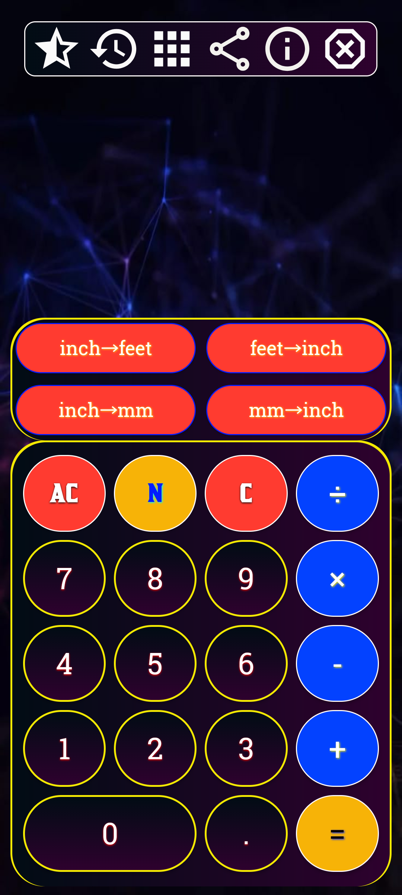
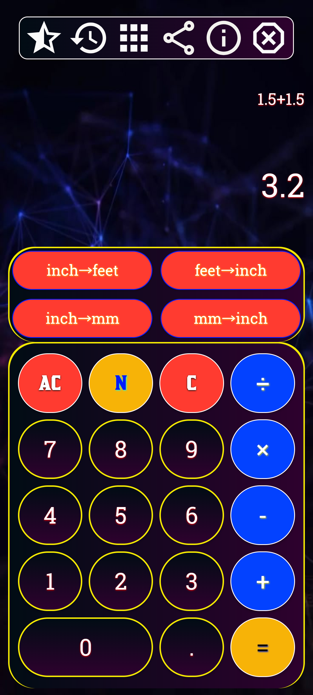
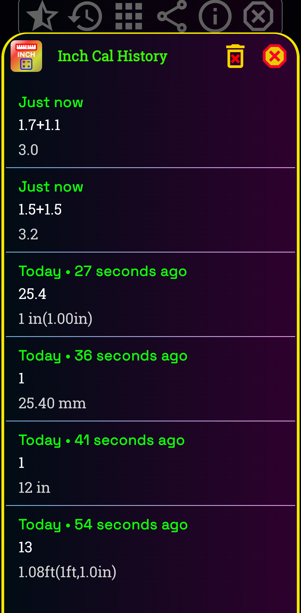

Feet Inch & mm Calculator

A simple, fast, and accurate Android application for converting and calculating measurements between Feet, Inches, Millimeters (mm), Centimeters (cm), Meters (m), and other common units. Perfect for engineers, architects, carpenters, students, and everyday users.

        📱 Features 
📏 Convert Feet to Inches, mm, cm, and Meters
📐 Convert Millimeters (mm) to Feet & Inches
🔄 Instant and accurate unit conversions
⚡ Fast calculation results
📱 Clean and easy-to-use interface
🌙 Modern Material Design
📴 Works offline
🚀 Lightweight and optimized for all Android devices

---

## 📸 Screenshots

### Screenshot 1

### Screenshot 2

### Screenshot 3

### Screenshot 4

### Screenshot 5

### Screenshot 6

### Screenshot 7

### Screenshot 8

---

## 📥 Download on Google Play

https://play.google.com/store/apps/details?id=com.nktech.inchcalculator
---

## 📧 Contact

**Developer:** NK Tech(NP)

Email: ournktech@gmail.com

Website: https://ournktech.com/

---

## ⭐ Support

If you like this project, please give it a ⭐ on GitHub!

---

## 📄 License

This project is licensed under the MIT License.